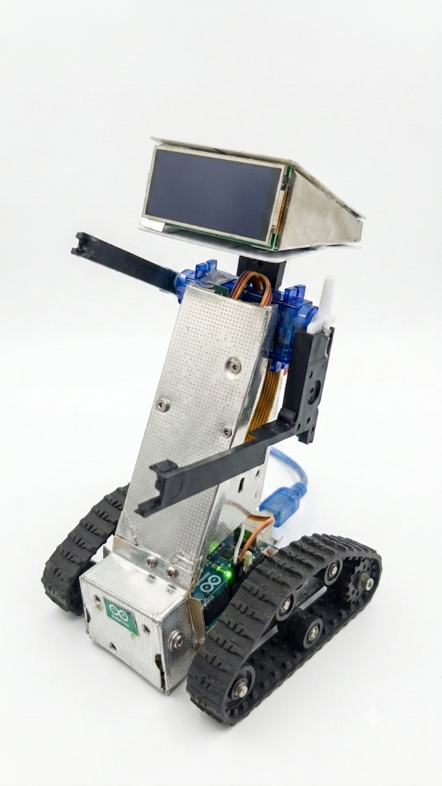

# AURA

AURA is an experimental AI-powered robotics project that combines speech, vision, memory, motion control, and Arduino communication into a single interactive system.



## Overview

AURA is designed to act as a voice-driven companion robot with the following capabilities:

- Voice input and speech-to-text processing
- AI reasoning and task planning
- Basic memory and conversation history
- Computer vision and object detection support
- Serial communication with Arduino-based hardware
- Text-to-speech output for robot responses

## Features

- Speech recognition via Whisper-style workflows
- Text-to-speech output for interactive responses
- Robot command execution over serial communication
- Vision-based inspection using OpenCV and YOLO-style detection
- Modular architecture for future expansion into perception, planning, and motion layers

## Project Structure

```text
AURA/
├── ai.py                 # Main AI command handling entrypoint
├── voice.py              # Voice interaction loop
├── mic.py                # Microphone input helpers
├── serial_comm.py        # Serial communication layer
├── requirements.txt     # Python dependencies
├── .env.example          # Example environment configuration
├── arduino/
│   └── robot.ino         # Arduino sketch for robot control
├── cognition/
│   ├── brain.py          # AI reasoning and planning logic
│   └── planner.py
├── memory/
│   ├── conversation.py   # Short-term memory handling
│   ├── long_memory.py    # Longer-term memory support
│   └── memory.json       # Stored memory data
├── motion/
│   └── robot.py          # Robot execution commands
├── speech/
│   ├── speaker.py        # Audio output
│   └── tts.py            # TTS helpers
├── vision/
│   ├── camera.py         # Camera utilities
│   ├── detector.py       # Vision detection logic
│   ├── live_camera.py    # Live camera display support
│   └── manager.py        # Vision orchestration
└── test_voice/           # Basic voice-related tests
```

## Requirements

The project is intended for Python environments on Windows and related desktop setups.

Required tools and dependencies include:

- Python 3.10+
- Git
- Virtual environment support
- Optional hardware: microphone, camera, Arduino-compatible board
- Optional local AI runtime: Ollama or similar service for advanced reasoning

## Installation

1. Clone the repository:

```bash
git clone https://github.com/Chandan-Chetia/AURA.git
cd AURA
```

2. Create and activate a virtual environment:

```bash
python -m venv .venv
.venv\Scripts\activate
```

3. Install Python dependencies:

```bash
pip install -r requirements.txt
```

4. Copy the example environment file and adjust values if needed:

```bash
copy .env.example .env
```

## Configuration

The project expects environment values for runtime-specific settings. Edit the `.env` file to configure:

- `OLLAMA_HOST`
- `OLLAMA_MODEL`
- `SERIAL_PORT`
- `SERIAL_BAUD_RATE`
- `VOICE_MODEL`
- `AUDIO_DEVICE_INDEX`

> The `.env` file is ignored by Git and should remain local to your machine.

## Running the Project

Start the voice interaction flow:

```bash
python voice.py
```

If you want to inspect or test the AI-related components separately, use the relevant scripts in the repository root or the `test_voice` folder.

## Hardware Notes

The repository includes Arduino support through the sketch in the `arduino/` folder. For real hardware runs, make sure:

- the correct serial port is configured in `.env`
- the Arduino board is connected and flashed properly
- microphone and camera peripherals are available if those features are used

## Roadmap

Planned improvements include:

- stronger vision pipeline integration
- improved conversation and memory persistence
- better command execution for robot motion
- more robust hardware abstraction and diagnostics
- packaging and deployment improvements

## License

This project is provided as-is for experimentation and development. Please review the repository contents and adapt the licensing terms if you intend to redistribute or commercialize it.

## Contributing

Contributions are welcome. If you want to improve the project, open an issue or submit a pull request with a clear explanation of the change.

